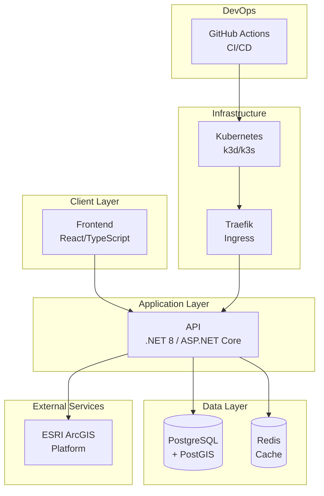

# RMS Demo ESRI Project

[](https://github.com/msftsean/rms-demo-esri/actions)
[](https://github.com/msftsean/rms-demo-esri/security)
[](https://github.com/msftsean/rms-demo-esri/actions)
[](LICENSE)

This is a demonstration project showcasing **Records Management System (RMS)** integration with **ESRI ArcGIS** technologies, featuring enterprise-grade DevOps practices and security controls.

## 🎯 Project Overview

The RMS Demo ESRI project demonstrates:

- **🗺️ GIS Integration**: Seamless integration with ESRI ArcGIS for geospatial data visualization
- **🔒 Security First**: Implementation of GitHub Advanced Security (GHAS) features
- **🚀 DevOps Excellence**: Comprehensive CI/CD pipelines with Azure DevOps and GitHub Actions
- **📊 Data Management**: Efficient handling of records with geographic context
- **🏢 Enterprise Ready**: Production-grade architecture and security practices

## 🏗️ Architecture

<!-- Updated diagram with proper Mermaid syntax -->


## ✨ Features

### 🗺️ **GIS Capabilities**
- Interactive mapping with ESRI JavaScript API
- Spatial data visualization and analysis
- Real-time geospatial queries
- Multi-layer map support
- Mobile-responsive design

### 🔐 **Security Features** 
- **CodeQL Analysis**: Automated static code analysis
- **Secret Scanning**: Prevention of credential leaks
- **Dependency Scanning**: Vulnerability detection in dependencies
- **Container Scanning**: Docker image security assessment
- **OAuth 2.0**: Secure authentication and authorization
- **RBAC**: Role-based access control

### 🚀 **DevOps Integration**
- **CI/CD**: GitHub Actions for security, build, test, and image scanning
- **Kubernetes Manifests**: Kustomize base for local k3s
- **Automated Testing**: Unit tests included
- **Environment**: Local (k3d/k3s with Traefik)
- **Monitoring**: Application Insights and health checks

## 🛠️ Technology Stack

| Component | Technology | Purpose |
|-----------|------------|---------|
| **Frontend** | React + TypeScript | User interface |
| **Backend API** | .NET 8 + ASP.NET Core | REST API services |
| **Database** | PostgreSQL + PostGIS | Spatial data storage |
| **Cache** | Redis | Performance optimization |
| **GIS Platform** | ESRI ArcGIS | Mapping and spatial analysis |
| **Authentication** | OAuth 2.0 + JWT | Security |
| **Containerization** | Docker | Image build and local dev |
| **Orchestration** | Kubernetes + Kustomize | Deployment & config |
| **Local Cluster** | k3d (k3s) + Traefik | Local cluster & ingress |
| **CI/CD** | GitHub Actions | Automation (build/test/security) |
| **Monitoring** | Application Insights | Observability |

## 🚀 Getting Started

### Prerequisites

- [.NET 8 SDK](https://dotnet.microsoft.com/download/dotnet/8.0)
- [Node.js 18+](https://nodejs.org/)
- [Docker Desktop](https://www.docker.com/products/docker-desktop)
- [ESRI Developer Account](https://developers.arcgis.com/)

### 🔑 Environment Setup

1. **Clone the repository**
```bash
git clone https://github.com/msftsean/rms-demo-esri.git
cd rms-demo-esri
```

2. **Configure environment variables**
```bash
cp .env.example .env
# Edit .env with your configuration
```

3. **Required Environment Variables**
```env
# Database
ConnectionStrings__DefaultConnection=Server=localhost;Database=rmsdemodb;User Id=rmsuser;Password=yourpassword;

# ESRI Configuration
ArcGIS__ApiKey=your_arcgis_api_key
ArcGIS__ClientId=your_client_id

# OAuth Configuration  
OAuth__ClientId=your_oauth_client_id
OAuth__ClientSecret=your_oauth_client_secret
OAuth__Authority=https://your-auth-provider

# External Services
Redis__ConnectionString=localhost:6379
```

### 🐳 Docker Development

```bash
# Start all services
docker-compose up -d

# View logs
docker-compose logs -f rms-demo

# Stop services
docker-compose down
```

### 💻 Local Development

```bash
# Restore dependencies
dotnet restore

# Start database
docker-compose up postgres redis -d

# Run migrations
dotnet ef database update

# Start API
dotnet run --project src/RmsDemo

# Start frontend (in separate terminal)
cd frontend
npm install
npm start
```

## 🧪 Testing

### Running Tests

```bash
# Unit tests
dotnet test

# Integration tests
dotnet test --filter Category=Integration

# Security tests
dotnet test --filter Category=Security

# Load tests
dotnet run --project tests/LoadTests
```

### Test Coverage

```bash
# Generate coverage report
dotnet test --collect:"XPlat Code Coverage"
reportgenerator -reports:"**/coverage.cobertura.xml" -targetdir:"coveragereport"
```

## 🔒 Security

This project implements comprehensive security measures:

### GitHub Advanced Security (GHAS)

- **🔍 CodeQL**: Automated security analysis
- **🔐 Secret Scanning**: Credential leak prevention  
- **📦 Dependency Review**: Vulnerability assessment
- **🚨 Security Advisories**: Private vulnerability disclosure

### Security Policies

- [Security Policy](SECURITY.md) - Vulnerability reporting process
- [Code of Conduct](CODE_OF_CONDUCT.md) - Community guidelines
- [Contributing Guidelines](CONTRIBUTING.md) - Development standards

### Compliance

- **SOC 2 Type II** ready architecture
- **GDPR** compliant data handling
- **OWASP Top 10** protection measures
- **NIST Cybersecurity Framework** alignment

## 📊 DevOps Comparison

| Feature | GitHub | Azure DevOps |
|---------|--------|--------------|
| **Source Control** | Git (native) | Git + TFVC |
| **CI/CD** | GitHub Actions | Azure Pipelines |
| **Project Management** | Issues + Projects | Boards + Backlogs |
| **Security** | GHAS + Dependabot | MSDO + Defender |
| **Artifacts** | Packages | Azure Artifacts |
| **Environments** | Environments | Release Management |

## 🌐 Deployment

### Local Kubernetes (k3d)

See SETUP_GUIDE.md for full steps. Quickstart:

```bash
# Create local cluster with Traefik LB on :8080
k3d cluster create rms-demo --agents 1 --port 8080:80@loadbalancer

# Build and import image into k3d
docker build -t rms-demo:local .
k3d image import rms-demo:local -c rms-demo

# Use cluster context and apply manifests
kubectl config use-context k3d-rms-demo
kubectl apply -k k8s
```

Access:
- Health: http://localhost:8080/health
- Swagger: http://localhost:8080/swagger

Alternative via Traefik host with Ingress:

```bash
# Build image with local tag
docker build -t rms-demo:local .

# Apply manifests (namespace, postgres+postgis, redis, api, ingress)
kubectl apply -k k8s/

# Access through Traefik using DNS that resolves to 127.0.0.1
open http://rms.localtest.me/
```

<!-- Cloud deployment removed for simplicity; this repo focuses on local k3s. -->

### GitHub Actions Deployment

Automated deployment triggered by:
- Push to `main` branch → Production
- Push to `develop` branch → Staging
- Pull requests → Review environments

### Azure DevOps Deployment

Integration with Azure DevOps for enterprise scenarios:
- Multi-stage pipelines
- Approval gates
- Release management
- Work item tracking

## 📈 Monitoring & Observability

- **Application Insights**: Performance monitoring
- **Log Analytics**: Centralized logging
- **Azure Monitor**: Infrastructure monitoring  
- **Grafana Dashboards**: Custom visualizations
- **Health Checks**: Service availability monitoring

## 🤝 Contributing

We welcome contributions! Please see our [Contributing Guide](CONTRIBUTING.md) for details.

### Development Workflow

1. Fork the repository
2. Create a feature branch (`git checkout -b feature/amazing-feature`)
3. Commit changes (`git commit -m 'Add amazing feature'`)
4. Push to branch (`git push origin feature/amazing-feature`)
5. Open a Pull Request

### Code Standards

- Follow [.NET coding conventions](https://docs.microsoft.com/en-us/dotnet/csharp/programming-guide/inside-a-program/coding-conventions)
- Write comprehensive tests
- Update documentation
- Pass all security scans

## 📚 Documentation

- [API Documentation](docs/api.md) - REST API reference
- [Architecture Guide](docs/architecture.md) - System design
- [Security Guide](docs/security.md) - Security implementation
- [Deployment Guide](docs/deployment.md) - Deployment procedures
- [ESRI Integration](docs/esri-integration.md) - GIS implementation

## 🎯 Demo Scenarios

This project supports various demonstration scenarios:

### 🔒 **Security Demo**
- GHAS features in action
- Vulnerability detection and remediation
- Secure development practices

### 🚀 **DevOps Demo**  
- GitHub vs Azure DevOps workflows
- Automated deployment pipelines
- Infrastructure as Code

### 🗺️ **GIS Demo**
- ESRI ArcGIS integration
- Spatial data visualization
- Geographic search and analysis

## 📄 License

This project is licensed under the MIT License - see the [LICENSE](LICENSE) file for details.

## 🙏 Acknowledgments

- **ESRI** for ArcGIS platform and documentation
- **Microsoft** for Azure services and development tools
- **GitHub** for Advanced Security features and Actions
- **Open Source Community** for the amazing tools and libraries

## 📞 Support

- **Issues**: [GitHub Issues](https://github.com/msftsean/rms-demo-esri/issues)
- **Discussions**: [GitHub Discussions](https://github.com/msftsean/rms-demo-esri/discussions)
- **Security**: [Security Policy](SECURITY.md)
- **Email**: sean.gayle@microsoft.com

---

**Built with ❤️ for enterprise developers and security professionals**
